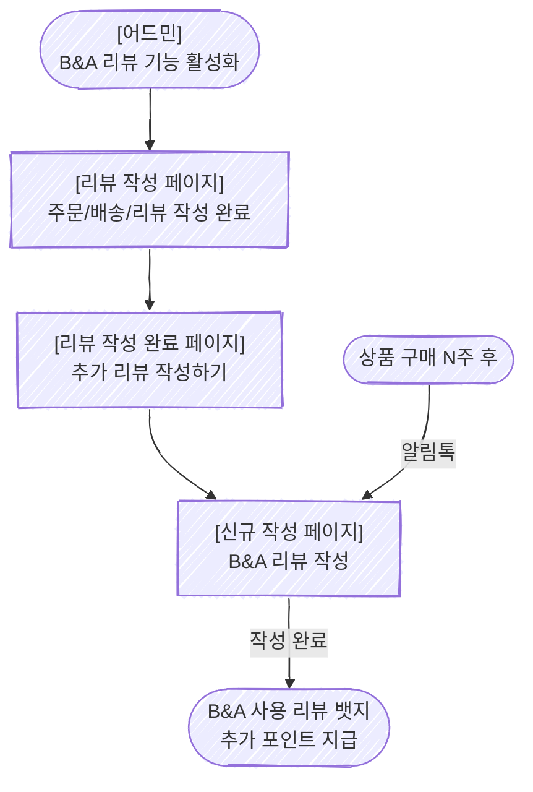

# 1. Problem

### **1-1. 프로젝트를 시작한 배경은 무엇인가요?**

> 0~2년 차 - 리뷰의 양이 부족
2~5년 차 - 양질의 리뷰가 부족
5년 차 ~ 리뷰 분석이 어려움
> 
- 알파리뷰는 **가장 많은 고객사 소규모 0~5년 차 쇼핑몰을 위한 양질의 리뷰 공급이 필요**합니다.
- 2026년 기준 리뷰의 절대적인 양보다는 양질의 리뷰가 중요하며 고품질의 리뷰를 확보하기 위해 지불하는 비용은 점점 커지고 있습니다.
- 2분기 OKR5 또한 해당 트렌드에 맞추어 고품질/다양한 리뷰 확보이며 목표를 달성하고 셀러의 전환율을 높일 수 있는 리뷰를 확보할 수 있도록 도와주는 기능이 필요합니다.

### **1-2. 고객은 어떤 문제를 가지고 있었나요?**

<aside>
🤯

화장품 **·** 헬스 카테고리 쇼핑몰은 **일반적인 리뷰로 제품의 실제 효과를 증명하기 어렵습니다.**

</aside>

### **1-3. 왜 문제라고 생각했나요?**

- 헬스/다이어트/스킨케어 카테고리는 알파리뷰의 고객의 18%를 차지하지만 **제품의 특징 상 효과 체감까지는 4~6주가 소**요되어 현재 알파리뷰가 제공하는 리뷰로는 실제 효과를 증명하기 어렵습니다.
- 따라서 실제 효과를 증명하기 위해서는 연구 기관 또는 인플루언서 또는 광고 업체와 컨택해야 하고 이는 업체에게 시간적,금전적 부담 더 나아가 매출 하락으로 이어집니다.
- 이 문제를 해결한다면 주요 고객사인 뷰티/헬스/다이어트/스킨케어 고객사(약 18%)의 판매량을 늘리고 매출을 올리는데 기여할 수 있습니다.

---

# 2. Appetite

### ✅ Batch 2주

- LLM/AI 분석 없이 룰베이스로 구현합니다.

---

# 3. Solution

### 3-1. 핵심 솔루션

<aside>
💡

장기 사용 리뷰로 실제 상품 사용 후 변화를 볼 수 있으면, **제품 효과를 설득력 있게 전달할 수 있기 때문에 화장품 · 헬스 카테고리 업체의 구매 전환율을 향상**시킬 것입니다.

</aside>

- **해당 솔루션을 선택한 이유**
    - 이미 비포/애프터 및 한달 사용 리뷰는 오프라인 피트니스/의료 홍보에서 많이 사용된 증명된 방법입니다.
    - 경쟁업체 크리마/브이리뷰 또한 해당 기능을 제공하고 있지 않아, 차별화된 경험을 줄 수 있습니다.

### 3-3. 솔루션 스케치 (Logic Flow)

| 단계 | 신규? | 화면 | 설명 |
| --- | --- | --- | --- |
| 1 | O | [대시보드] B&A 기능 관리 페이지 | 관리자가 어드민에서 B&A 리뷰 기능을 활성화. 적용 상품 혹은 카테고리, 대기 기간(2주/4주/6주 선택 제공), 추가 적립금, 리뷰 가이드라인 등을 설정. |
| 2 | X | 리뷰 작성 페이지 | 기존과 동일 |
| 3 | O | 작성 완료 페이지 | B&A 리뷰 작성 섹션 추가 |
| 4 | O | B&A 리뷰 작성 페이지 | B&A양식에 맞는 사진과 텍스트 리뷰를 함께 작성 |
| 5 | O | 대기 기간 경과 후 알림톡 발송 | 설정한 대기 기간이 지난 후, B/A 리뷰 알림톡을 발송 |
| 6 | O | ‘B&A’ 사용 리뷰’ 뱃지  | 작성된 리뷰에 ‘B&A 사용 리뷰’ 전용 뱃지가 자동 부여 |
| 7 | O | 작성자에게 추가 적립금 지급 | 완료한 유저에게 추가 적립금을 지급합니다. |
- 대기 기간은 2주/4주/6주/8주 정도로 선택지를 줄여서 제공하며 추후 확장합니다.
- 기존 리뷰와 장기 사용 리뷰는 하나의 리뷰에서 함께 보여주는 UI가 필요합니다.

<aside>

**Edge Case**

1. 비회원이 회원 전환을 안해서 포인트 지급이 유예된 상황이라면 별도로 추가 알림톡을 보내진 않음
2. 리뷰 요청은 추가 B/A 알림을 발송하지 않음
</aside>

### Fat Marker Sketch

1. **B&A 기능 관리 페이지**
    
    
    

**3. 작성 완료 페이지**

**4. B&A 리뷰 작성 페이지**

## 고민 지점

- 작성할 리뷰 더보기 없애기 vs 비포앤애프터 들어간 후 상품 선택
    - 장점 / 단점
- 작성 완료후 노출 vs 리뷰 작성페이지 아래에 노출
    - 장점 / 단점

---

[상세 기능 정의서 (작성중) (1)](https://www.notion.so/1-36fa323fd4af80c09036ce896bd07a00?pvs=21)

---

# 4. FAQ

**Q1: 반품·취소·교환이 발생했을 때는?**
→ 대기 기간 후 알림톡 발송 플로우가 취소됩니다. 설정 기간이 지난 후, 알림톡을 전송하지 않습니다.

**Q2: 기존 한달 사용기 뱃지와 차이점?**
→ 한달 사용기는 단순 뱃지지만, B/A리뷰는 전후 리뷰를 함께 보여줍니다.

---

# 5. Map the Scopes

### Unknown (아직 알아보는 단계)

- 위젯 노출 여부
- 장기사용 리뷰 작성가이드

### Known (개발 범위를 위한 세팅)

| 항목 | 내용 |
| --- | --- |
|  |  |
|  |  |

---

# 6. No-Gos

- 개발 공수를 줄이기 위해 일단 LLM 사용없이 해결합니다.

---

# 7. Definition of Done (완료 조건)

| 지표 | 알고 싶은 점 | 목표 |
| --- | --- | --- |
| 장기 사용 리뷰 클릭율 | 장기 사용 리뷰가 엔드유저에게 유용한가? | 일반 리뷰 대비 2배 |
| 장기 사용 리뷰 적용 업체 수 | 장기 사용 리뷰가 업체에게 유용한가? | 출시 3개월 내 100개 |
| 장기 사용 리뷰 작성율 | 장기 사용 리뷰를 작성하는데 어려움은 없는가? | 장기 사용 리뷰 작성율 2% 목표

현재 리뷰 작성율 5~10%(아누아 기준 5%) |

---

‣ 

### Reference (참고자료)

- [리뷰 요청 타이밍 베스트 프랙티스 - PowerReviews](https://www.powerreviews.com/when-to-ask-for-reviews-best-practice-guide/) — 스킨케어 제품의 리뷰 요청은 4~6주 후가 적정
- [리뷰 요청 타이밍 가이드 - Reviews.io](https://blog.reviews.io/post/timing-is-everything-ask-for-reviews-at-the-right-time) — 멀티터치 팔로업 시 리뷰 응답률 12~18% 달성 가능
- [뷰티 이커머스 트렌드 2026 - Hypotenuse AI](https://www.hypotenuse.ai/blog/beauty-ecommerce-trends-2026) — 온라인 뷰티 매출 오프라인 대비 9배 성장
- [이커머스 전환율 벤치마크 2026 - Skailama](https://www.skailama.com/blog/ecommerce-conversion-rate-by-industry) — 뷰티 카테고리 평균 전환율 2~4%
- [HBR: When Is the Best Time to Ask Customers for a Review?](https://hbr.org/2023/02/when-is-the-best-time-to-ask-customers-for-a-review) — 리뷰 요청 타이밍이 리뷰 품질과 양에 미치는 영향
- **~~Deleted~~**
    
    ### ~~3-2. 솔루션을 위해 이루어 져야할 것 (Jobs to be Done)~~
    
    - ~~엔드 유저가 Before/After에 최적화된 위젯을 볼 수 있다.~~
    - ~~엔드 유저가 Before/After 리뷰를 작성할 수 있다.~~
    - ~~고객이 Before/After 위젯을 설정하고 배치할 수 있다.~~
    - ~~엔드 유저가 고객이 Before와 After 시점에 리뷰를 작성하도록 알림 받을 수 있다.~~
