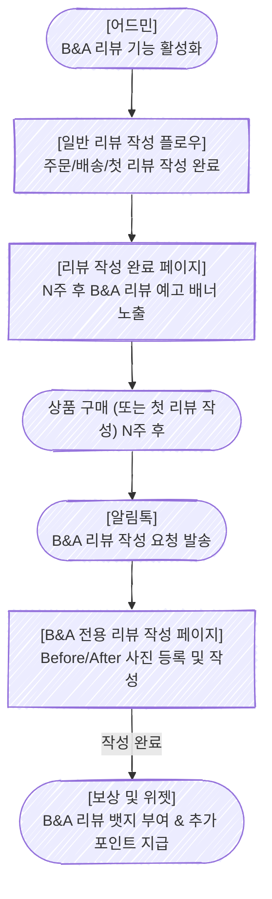

# 1. Problem

### **1-1. 프로젝트를 시작한 배경은 무엇인가요?**

> 0~2년 차 - 리뷰의 양이 부족
2~5년 차 - 양질의 리뷰가 부족
5년 차 ~ 리뷰 분석이 어려움
> 
- 알파리뷰는 **가장 많은 고객사 소규모 0~5년 차 쇼핑몰을 위한 양질의 리뷰 공급이 필요**합니다.
- 2026년 기준 리뷰의 절대적인 양보다는 양질의 리뷰가 중요하며 고품질의 리뷰를 확보하기 위해 지불하는 비용은 점점 커지고 있습니다.
- 2분기 OKR5 또한 해당 트렌드에 맞추어 고품질/다양한 리뷰 확보이며 목표를 달성하고 셀러의 전환율을 높일 수 있는 리뷰를 확보할 수 있도록 도와주는 기능이 필요합니다.

### **1-2. 고객은 어떤 문제를 가지고 있었나요?**

<aside>
🤯

화장품 **·** 헬스 카테고리 쇼핑몰은 **일반적인 리뷰로 제품의 실제 효과를 증명하기 어렵습니다.**

</aside>

### **1-3. 왜 문제라고 생각했나요?**

- 헬스/다이어트/스킨케어 카테고리는 알파리뷰의 고객의 18%를 차지하지만 **제품의 특징 상 효과 체감까지는 4~6주가 소**요되어 현재 알파리뷰가 주로 제공하는 구매 직후 리뷰로는 실제 효과를 증명하기 어렵습니다.
- 따라서 실제 효과를 증명하기 위해서는 연구 기관 또는 인플루언서, 광고 업체와 컨택해야 하고 이는 업체에게 시간적, 금전적 부담 더 나아가 매출 하락으로 이어집니다.
- 이 문제를 해결한다면 주요 고객사인 뷰티/헬스/다이어트/스킨케어 고객사(약 18%)의 판매량을 늘리고 매출을 올리는데 직접적으로 기여할 수 있습니다.

---

# 2. Appetite

### ✅ Batch 2주

- LLM/AI 분석 없이 룰베이스로 구현합니다.
- 복잡한 AI 이미지 분석(비포/애프터 진위 여부 파악 등)은 배제하고, 유저가 직접 업로드하는 사진 두 장(Before & After)을 기반으로 UI/UX를 구성합니다.

---

# 3. Solution

### 3-1. 핵심 솔루션

<aside>
💡

장기 사용 리뷰로 실제 상품 사용 후 변화를 볼 수 있으면, **제품 효과를 설득력 있게 전달할 수 있기 때문에 화장품 · 헬스 카테고리 업체의 구매 전환율을 향상**시킬 것입니다.

</aside>

- **해당 솔루션을 선택한 이유**
    - 이미 비포/애프터 및 한달 사용 리뷰는 오프라인 피트니스/의료 홍보에서 많이 사용된 증명된 방법입니다.
    - 경쟁업체 크리마/브이리뷰 또한 해당 기능을 (비포/애프터 전용 포맷으로) 명확히 제공하고 있지 않아, 차별화된 경험을 줄 수 있습니다.

### 3-2. 솔루션 스케치 (Logic Flow)

| 단계 | 신규? | 화면 | 설명 |
| --- | --- | --- | --- |
| 1 | O | [대시보드] B&A 기능 관리 페이지 | 관리자가 어드민에서 B&A 리뷰 기능을 활성화. 적용 상품 혹은 카테고리, 대기 기간(2주/4주/6주/8주 선택 제공), 추가 적립금, 리뷰 가이드라인 등을 설정. |
| 2 | X | (기존) 리뷰 작성 페이지 | 기존과 동일하게 첫 구매 리뷰 작성 |
| 3 | O | 작성 완료 페이지 | 첫 리뷰 작성 완료 후 "N주 뒤 B&A 리뷰 작성 시 추가 혜택"을 안내하는 섹션 노출 (비포 사진 촬영 유도) |
| 4 | O | 대기 기간 경과 후 알림톡 발송 | 설정한 대기 기간이 지난 후, B/A 리뷰 알림톡을 발송 (리뷰 미작성자에게도 동일 발송 혹은 분기 처리 옵션 제공) |
| 5 | O | B&A 리뷰 작성 페이지 | B&A양식에 맞는 폼 제공 (Before 사진 1장 이상, After 사진 1장 이상 필수 첨부 및 텍스트 작성) |
| 6 | O | ‘B&A 사용 리뷰’ 뱃지 | 작성된 리뷰에 ‘B&A 사용 리뷰’ 전용 뱃지가 자동 부여되고, 두 사진이 비교하기 좋게 위젯에 노출됨 |
| 7 | O | 작성자에게 추가 적립금 지급 | 조건을 충족하여 작성 완료한 유저에게 설정된 추가 적립금 지급 |

- 대기 기간은 2주/4주/6주/8주 정도로 선택지를 줄여서 제공하며 추후 확장합니다.
- 기존 리뷰와 장기 사용 리뷰는 하나의 리뷰 위젯에서 **함께/비교하기 쉽게(Before-After 분할 화면 등)** 보여주는 UI가 필요합니다.

<aside>

**Edge Case**

1. 비회원이 회원 전환을 안해서 포인트 지급이 유예된 상황이라면 별도로 추가 알림톡을 보내진 않음.
2. 첫 리뷰 작성 없이 시간이 흐른 경우: 해당 시점(N주 후)에 바로 B&A 리뷰를 작성할 수 있도록 유도 (사용자가 과거 사진과 현재 사진을 동시에 업로드).
3. 사진을 1장만 올리거나 텍스트만 쓴 경우: B&A 리뷰 등록이 불가하도록 Validation 처리 (Before/After 각각 최소 1장 필수).
4. 반품·취소·교환 발생 시: 대기 기간 중이더라도 알림톡 발송 플로우 자동 취소.
</aside>

### 3-3. 고민 지점 (Pros/Cons 분석)

- **작성할 리뷰 더보기 없애기 vs 비포앤애프터 메뉴 들어간 후 상품 선택**
    - **Option A (기존 목록에 통합 노출):**
        - **장점:** 유저가 '작성 가능한 리뷰' 진입 시 한 번에 인지할 수 있어 접근성이 높고, 놓칠 확률이 적음.
        - **단점:** 일반 리뷰와 장기 리뷰가 섞여 보여, 유저가 혼란을 느끼거나 사진 두 장이 필요한 허들을 인지하지 못하고 이탈할 수 있음.
    - **Option B (전용 메뉴/탭 분리 후 상품 선택):**
        - **장점:** '장기 사용 B&A 리뷰'라는 특수성과 가이드라인(사진 2장 필수, 추가 포인트 등)을 명확하게 안내한 후 리뷰를 쓰게 할 수 있음.
        - **단점:** 뎁스가 추가되어 진입 전환율 자체가 낮아질 수 있음.
    - **제안:** 우선 Option A로 가되, 해당 아이템 카드에 "B&A 전용 - 추가 000원" 이라는 뱃지를 강하게 주어 클릭을 유도하는 방식 추천.

- **안내 노출 위치: 작성 완료 후 노출 vs 리뷰 작성페이지 아래에 노출** (첫 리뷰 시점)
    - **Option A (리뷰 작성 완료 페이지 땡큐 배너로 노출):**
        - **장점:** 첫 리뷰 작성(가장 중요한 핵심 액션)을 방해하지 않음. 혜택 획득 직후라 추가 혜택에 대한 긍정적 수용도가 높음.
        - **단점:** 리뷰 작성 후 바로 창을 닫아버리는 유저는 안내를 전혀 보지 못할 수 있음 (비포 사진 촬영 기회 상실).
    - **Option B (리뷰 작성 폼 하단 노출):**
        - **장점:** 리뷰 작성 중 반드시 보게 되므로 인지율이 매우 높고, 비포 사진 촬영을 미리 유도하기 좋음.
        - **단점:** 리뷰 작성 폼이 길어지고 정보량이 많아져, 첫 리뷰 작성 완료율 자체가 떨어질 치명적 위험이 있음.
    - **제안:** 첫 리뷰 완료율을 해치지 않는 **Option A**를 기본으로 하되, 닫기 전 팝업이나 눈에 띄는 애니메이션 배너로 이탈 전 인지율을 높이는 방향 추천.

---

# 4. FAQ

**Q1: 반품·취소·교환이 발생했을 때는?**
→ 대기 기간 후 알림톡 발송 플로우가 자동으로 취소됩니다. 설정 기간이 지난 후 알림톡을 전송하지 않습니다.

**Q2: 기존 한달 사용기 뱃지와 차이점?**
→ 한달 사용기는 단순히 기간이 지났음을 알리는 뱃지지만, B/A 리뷰는 사용자가 직접 'Before'와 'After' 사진을 지정하여 전후 변화를 UI 상에서 직관적으로 비교해서 보여주는 차별화된 포맷입니다.

**Q3: 첫 리뷰를 안 쓴 사람도 B/A 리뷰를 쓸 수 있나요?**
→ 네, 구매 확정 후 N주가 지난 유저에게 알림톡이 발송되며, 이때 본인이 가지고 있던 과거 사진(Before)과 현재 사진(After)을 함께 올려 B/A 리뷰를 작성할 수 있습니다.

---

# 5. Map the Scopes

### Unknown (아직 알아보는 단계)

- 위젯 노출 UI 디자인 (Before/After 슬라이더 방식 vs 병렬 배치 방식)
- 장기사용 리뷰 작성 가이드라인 (어떤 식으로 찍어야 잘 나오는지 안내하는 기본 템플릿 제공 여부)
- (추후고민) 이미 일반 텍스트 포토 리뷰를 남긴 유저의 Before 사진을 B&A 리뷰 작성 시 자동으로 불러와 줄 것인가?

### Known (개발 범위를 위한 세팅)

| 항목 | 내용 |
| --- | --- |
| **어드민 설정** | B&A 기능 On/Off, 적용 카테고리/상품 지정, 대기 기간(2,4,6,8주) 설정, B&A 전용 지급 포인트 설정 |
| **알림톡** | 대기 기간 경과 후 자동 발송되는 B&A 작성 요청 알림톡 템플릿 연동 및 발송 스케줄러 로직 |
| **프론트엔드 (리뷰 폼)** | Before 사진 첨부란과 After 사진 첨부란이 분리된 전용 리뷰 작성 폼 개발 (최소 2장 필수 Validation) |
| **프론트엔드 (위젯)** | 리뷰 목록 및 상세 뷰에서 'B&A 리뷰 뱃지' 노출 및 두 사진을 비교해주는 UI 컴포넌트 개발 |
| **데이터베이스** | 리뷰 테이블에 B&A 리뷰 타입 플래그 및 Before/After 이미지 URL 분리 저장 구조 추가 |

---

# 6. No-Gos

- 개발 공수를 줄이기 위해 일단 LLM/AI 이미지 분석(합성 판별, 얼굴 인식 등)을 통한 진위 여부 파악은 해결 범위에서 제외합니다. 전적으로 유저의 업로드에 의존합니다.
- 복잡한 B&A 전용 필터나 비디오 영상(Video B&A) 지원은 V1에서는 제외합니다. 이미지(사진)에만 한정합니다.

---

# 7. Definition of Done (완료 조건)

| 지표 | 알고 싶은 점 | 목표 |
| --- | --- | --- |
| 장기 사용 리뷰 클릭율 | 장기 사용 리뷰가 엔드유저에게 유용한가? | 일반 리뷰 대비 2배 |
| 장기 사용 리뷰 적용 업체 수 | 장기 사용 리뷰가 업체에게 유용한가? | 출시 3개월 내 100개 |
| 장기 사용 리뷰 작성 전환율 | 장기 사용 리뷰를 작성하는데 어려움은 없는가? | **알림톡 수신 대비 작성 완료율 2% 목표** (현재 일반 리뷰 작성률 5~10% 대비, 사진 2장 등 허들이 높음을 감안하여 합리적인 목표로 2% 설정) |

---

### Reference (참고자료)

- [리뷰 요청 타이밍 베스트 프랙티스 - PowerReviews](https://www.powerreviews.com/when-to-ask-for-reviews-best-practice-guide/) — 스킨케어 제품의 리뷰 요청은 4~6주 후가 적정
- [리뷰 요청 타이밍 가이드 - Reviews.io](https://blog.reviews.io/post/timing-is-everything-ask-for-reviews-at-the-right-time) — 멀티터치 팔로업 시 리뷰 응답률 12~18% 달성 가능
- [뷰티 이커머스 트렌드 2026 - Hypotenuse AI](https://www.hypotenuse.ai/blog/beauty-ecommerce-trends-2026) — 온라인 뷰티 매출 오프라인 대비 9배 성장
- [이커머스 전환율 벤치마크 2026 - Skailama](https://www.skailama.com/blog/ecommerce-conversion-rate-by-industry) — 뷰티 카테고리 평균 전환율 2~4%
- [HBR: When Is the Best Time to Ask Customers for a Review?](https://hbr.org/2023/02/when-is-the-best-time-to-ask-customers-for-a-review) — 리뷰 요청 타이밍이 리뷰 품질과 양에 미치는 영향